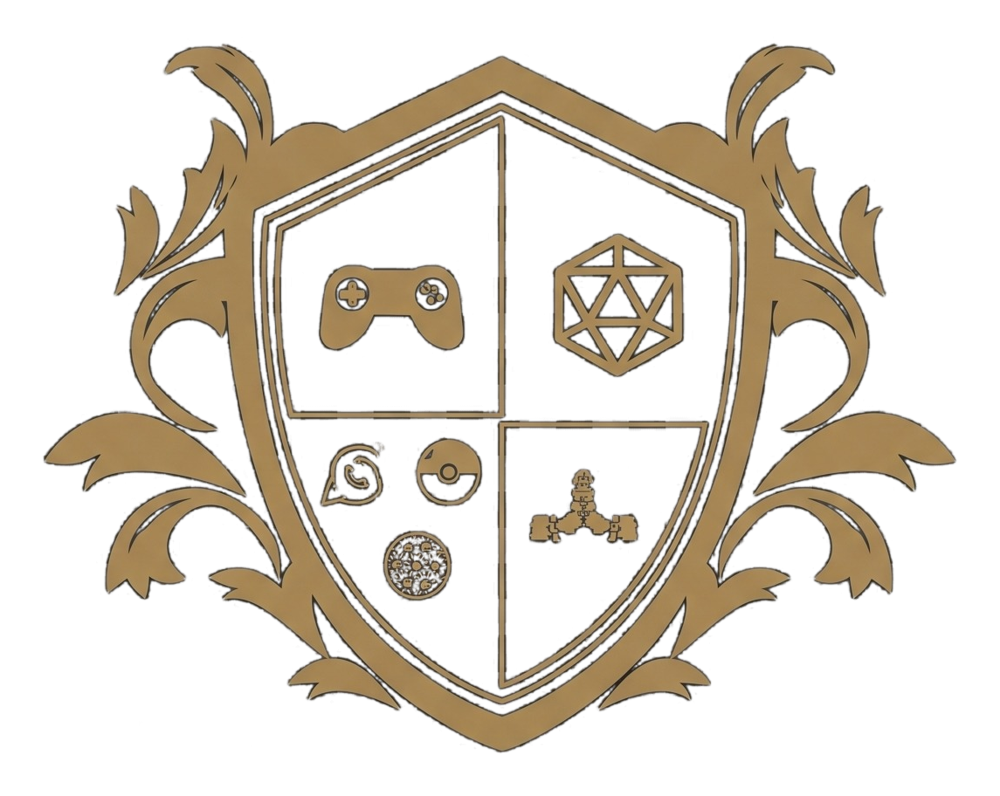

<p align="center">
  
</p>

# Távola VTT

**Távola VTT** é uma mesa virtual de RPG personalizada, com mapas, tokens, névoa de guerra, grades, dados, encontros, iniciativa, notas e uma janela separada para a visão do jogador.

Esta versão é desenvolvida no repositório [Ericcunha-98](https://github.com/Ericcunha-98) a partir de uma base de código aberto. Não utiliza o código do projeto Távola anterior, apenas a marca e seu brasão.

## Personalização realizada

- Nome de exibição, manifesto e identidade visual inicial **Távola VTT**.
- Brasão oficial do Távola adicionado à identidade do fork.
- Envio de relatórios para o antigo servidor de terceiros **desativado**.
- Compêndio de D&D **não incluído** nesta etapa.

**Importante:** esta primeira versão ainda depende do **Obsidian desktop** e não inclui login próprio nem multiplayer pela internet. A infraestrutura de autenticação, contas administradas por você, servidor e sincronização próprios serão implementações futuras; não foram copiadas do projeto antigo.

## Como executar a versão atual

Requer Obsidian 1.8.7 ou superior e Node.js 22+ para desenvolvimento.

```bash
npm ci
npm run build
npm test
```

Para uma instalação manual, coloque `main.js`, `manifest.json` e `styles.css` compilados em `<vault>/.obsidian/plugins/tavola-vtt/` e ative o plugin no Obsidian.

## Recursos da base técnica

- Mapas com grades quadradas e hexagonais, alinhamento de grade e zoom.
- Tokens e encontros, iniciativa, dados e registros.
- Iluminação, visão do jogador, anotações, medidores, áudio local.

## Próximos marcos

1. Reduzir dependências do Obsidian, mantendo o renderizador de mapas e recursos úteis.
2. Implementar autenticação e contas administradas pelo proprietário.
3. Desenvolver backend, persistência e rede multiplayer próprios.
4. Validar o novo VTT web sem compêndio.

## Licenças e autoria original

Este é um trabalho derivado do **Atlas VTT**, originalmente desenvolvido por **Fabian Urbanek** (copyright 2025–2026), sob a licença **GNU AGPL-3.0-only**. A identidade Távola não transfere a autoria do código original. Os avisos legais e direitos de terceiros permanecem aplicáveis, inclusive para distribuição e versões modificadas acessíveis em rede.

Fonte original: https://github.com/atlas-vtt/atlas-vtt

Consulte [LICENSE](LICENSE) e [THIRD_PARTY_NOTICES.md](THIRD_PARTY_NOTICES.md) para termos e atribuições.
